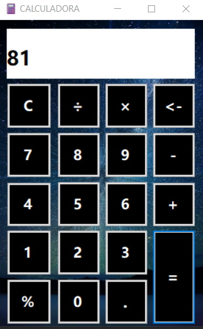

# CALCULADORA COM WINFORMS
👨‍🏫APP SIMPLES DE CALCULADORA COM WINFORMS.

  

## DESCRIÇÃO:
Este aplicativo WinForms é uma calculadora básica que permite aos usuários realizar operações matemáticas simples, como adição, subtração, multiplicação, divisão e porcentagem. Ele oferece uma interface intuitiva com botões numéricos e operacionais para facilitar a entrada de dados e a execução de cálculos.

## FUNCIONALIDADES:
1. **Operações Básicas**:
   - **Adição (+)**: Soma dois números.
   - **Subtração (-)**: Subtrai um número de outro.
   - **Multiplicação (×)**: Multiplica dois números.
   - **Divisão (/)**: Divide um número por outro.
   - **Porcentagem (%)**: Calcula a porcentagem de um número.

2. **Limpeza e Correção**:
   - **Botão de Limpar (C)**: Limpa os campos de entrada e a tela de operações.
   - **Botão de Apagar**: Remove o último dígito inserido no campo de entrada.

3. **Teclado Numérico**:
   - Aceita entrada através do teclado numérico do computador para maior conveniência.

## EXECUTANDO O PROJETO:
### ABRINDO NO VISUAL STUDIO:
- Abra o projeto `./CODIGO` no Visual Studio:
  1. Abra o Visual Studio.
  2. Clique em `File` > `Open` > `Project/Solution`.
  3. Navegue até o diretório `./CODIGO`.
  4. Selecione o arquivo da solução (`.sln`) do projeto e clique em `Open`.
  5. No Solution Explorer, abra o arquivo `Program.cs` para ver o código-fonte.

#### COMPILANDO E EXECUTANDO O PROJETO:
1. Pressione `Ctrl + Shift + B` para compilar o projeto.
2. Após a compilação, pressione `Ctrl + F5` para executar o projeto sem depuração.

### ABRINDO O EXECUTÁVEL:
- Abra o executável em `CODIGO/WindowsFormsApp1/bin/Debug/WindowsFormsApp1.exe`:
  1. Abra o Explorador de Arquivos.
  2. Navegue até o diretório `CODIGO/WindowsFormsApp1/bin/Debug`.
  3. Dê um duplo clique no arquivo `WindowsFormsApp1.exe` para executar o aplicativo.

### INTERAGINDO COM APP:
1. **Iniciar o Aplicativo**:
   - Abra o aplicativo. A calculadora será exibida na janela principal (`Form1`).

2. **Realizar Operações**:
   - **Inserir Números**: Clique nos botões numéricos (0-9) para inserir os números desejados no campo de entrada (`txtAccActual`).
   - **Selecionar Operação**: Clique nos botões de operação (`+`, `-`, `×`, `/`, `%`) para selecionar a operação desejada. A operação selecionada será exibida na tela de operações (`richPantalla`).
   - **Calcular**: Clique no botão "=" para calcular o resultado da operação selecionada. O resultado será exibido no campo de entrada (`txtAccActual`) e a tela de operações será limpa.

3. **Limpar e Corrigir**:
   - **Botão "C"**: Limpa todos os campos e reinicia a calculadora.
   - **Botão de Apagar**: Remove o último dígito inserido no campo de entrada para correções.

## NÃO SABE?
- Entendemos que para manipular arquivos nas linguagens relacionadas, é necessário possuir conhecimento nessas áreas. Para auxiliar nesse aprendizado, oferecemos cursos gratuitos disponíveis:
* [CURSO DE WINFORMS](https://github.com/VILHALVA/CURSO-DE-WINFORMS)
* [CURSO DE C#](https://github.com/VILHALVA/CURSO-DE-C-SHARP)
* [CONFIRA MAIS CURSOS](https://github.com/VILHALVA?tab=repositories&q=+topic:CURSO)

## CREDITOS:
- [PROJETO CRIADO PELO "JoseCebada"](https://github.com/JoseCebada/Calculadora_WinForms)
- [PROJETO FEITO PELO VILHALVA](https://github.com/VILHALVA)

